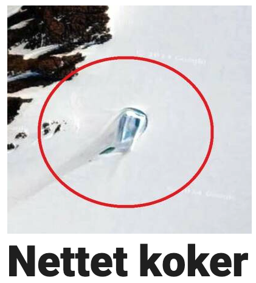
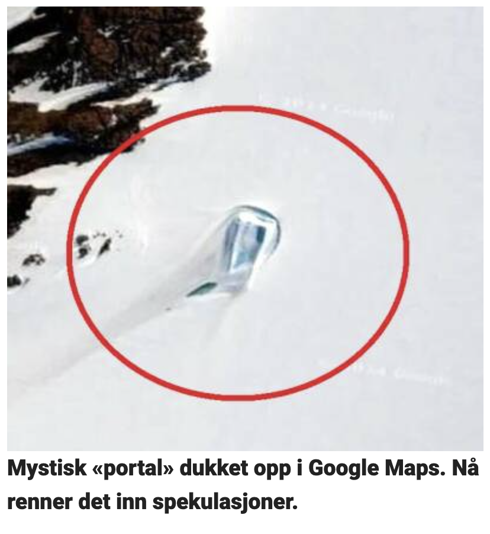

# Dagbladet Clickbait Expander

## Overview
Dagbladet.no, a Norwegian news website, has become somewhat notorious for using short and dramatic headlines to entice users to click on articles; also known as clickbaiting. Unfortunately, the articles themselves are often not as thrilling as the headlines might suggest. This browser extension addresses part of the problem by replacing particularly short headlines with the article's ingress. This should save users the trouble of clicking on articles that are presented as more dramatic than they actually are.

## How It Works
The extension identifies short headlines on Dagbladet.no and replaces them with the article's lead paragraph, providing users with a more accurate preview of the content before they decide to click on the article.

## Examples
Below are examples demonstrating the difference between the original short headlines and the expanded previews provided by the extension:

| Without Expander | With Expander |
|------------------|---------------|
|  |  |
|  |  |

## Installation
To use the Dagbladet Clickbait Expander extension, follow these steps:
1. Download the extension from [GitHub](https://github.com/azizfazlagic/Dagbladet-Expander).
2. Install the extension in your browser.
    - Open your browser’s extension page (for Chrome, it’s chrome://extensions).
    - Turn on "Developer mode", click "Load unpacked", and pick the unzipped folder.
3. Navigate to Dagbladet.no, and the extension will automatically detect and expand short headlines.

## Feedback and Contributions
Feedback and contributions to improve the functionality and effectiveness of the extension are welcome. If you encounter any issue(s) or have suggestions for enhancements, please feel free to open an issue or submit a pull request on [GitHub](#).
